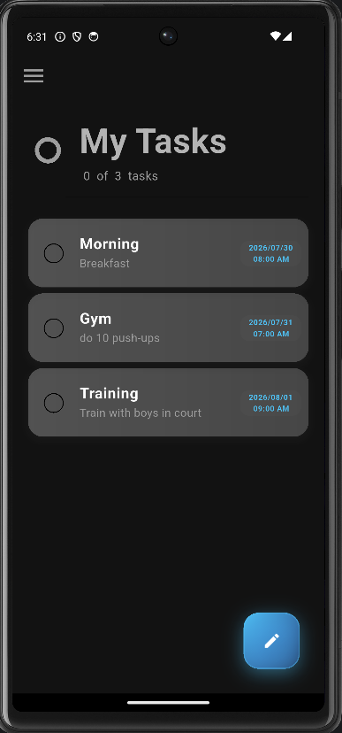
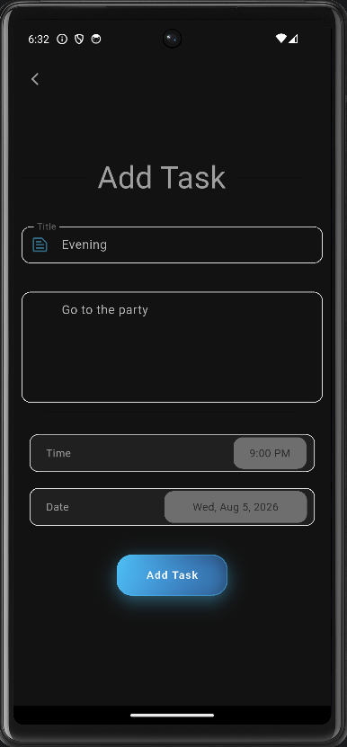
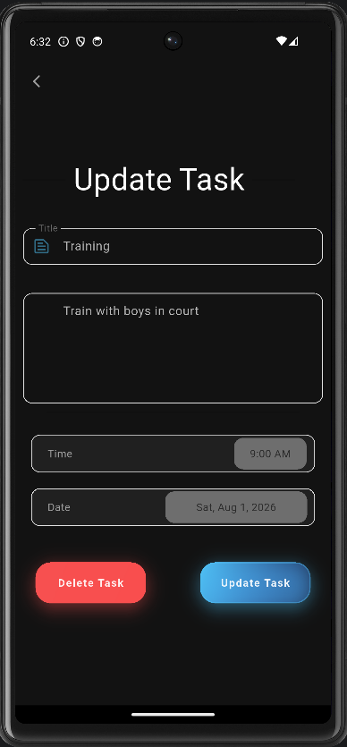
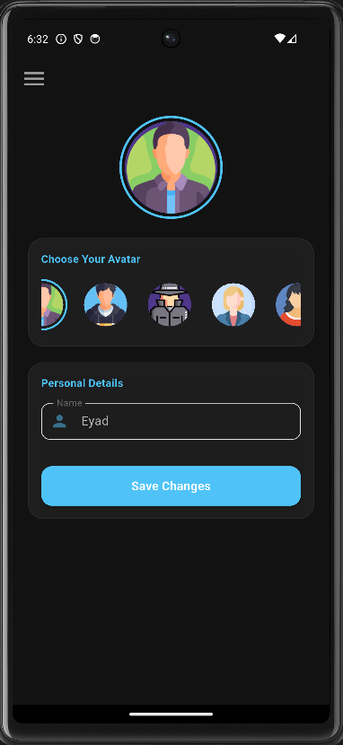
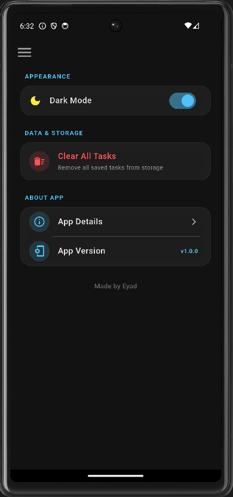
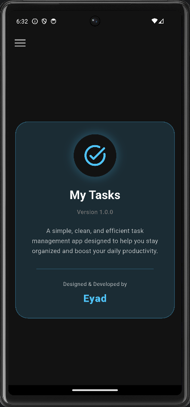

# 📝 Task Master - Modern Flutter Task Management App

A sleek, feature-rich, and high-performance task management application built with **Flutter** and **Hive Local Storage**. Designed with a premium dark-themed UI, subtle neon glowing interactions, and smooth micro-animations to enhance daily productivity.

---

## 📸 Screenshots

| Home Screen | Add Task | Update Task |
| :---: | :---: | :---: |
|  |  |  |

| Profile & Avatar | App Settings | App Info |
| :---: | :---: | :---: |
|  |  |  |

---

## ✨ Key Features

* **Full Offline Support (Offline-First):** Powered by Hive for zero-latency local data persistence.
* **Interactive Task Status:** Dynamic checkbox updates with strike-through styling and opacity transitions.
* **Modern Dark Aesthetics:** Premium charcoal theme featuring neon blue glowing indicators and soft red action buttons.
* **Custom Avatar Selection:** Personalized user experience with customizable profiles and avatars.
* **Smart App Settings:** Dedicated control over app data, appearance modes, and application versions.
* **Intuitive Navigation Drawer:** Seamless screen transition and quick category access.
* **Responsive Architecture:** Pixel-perfect layout adaptation across all mobile screen sizes.

---

## 🛠️ Tech Stack & Dependencies

* **Framework:** [Flutter](https://flutter.dev) (Dart)
* **Local Storage:** [Hive](https://pub.dev/packages/hive) & [Hive Flutter](https://pub.dev/packages/hive_flutter)
* **Code Generation:** [Hive Generator](https://pub.dev/packages/hive_generator) & [Build Runner](https://pub.dev/packages/build_runner)
* **Architecture:** Modular Clean Architecture (Separation of Data, UI, and Business Logic)

---

## 📁 Project Structure

```text
lib/
├── buttons/        # Custom reusable buttons (Add, Delete, etc.)
├── data/           # Hive data store and local database management
├── main_widgets/   # Core reusable UI widgets (Cards, Drawers, AppBars)
├── models/         # Task models & Hive TypeAdapters
├── screens/        # Application screens (Home, Add, Update, Profile, Settings)
└── utils/          # Constants, themes, and custom text fields